

  <b>Русский</b> · <a href="README.en.md">English</a>

  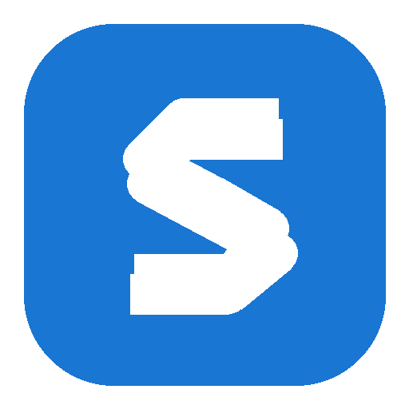

<h1 align="center">SubsTrack</h1>

  Трекер подписок, платежей и напоминаний для Android и веба.

  <a href="https://substrack.top"><b>Открыть сайт</b></a>
  &nbsp;·&nbsp;
  <a href="https://github.com/svllvsxprod/substrack-releases/releases/latest"><b>Скачать APK</b></a>
  &nbsp;·&nbsp;
  <a href="#установка"><b>Установка</b></a>

<table align="center">
  <tr>
    <td align="center" width="760">
      <h3>Поддержите разработку</h3>
      
Поддержка помогает оплачивать сервер и выпускать новые версии SubsTrack.

      <table align="center">
        <tr>
          <td align="center" width="350"></td>
          <td align="center" width="350"></td>
        </tr>
        <tr>
          <td align="center" colspan="2"></td>
        </tr>
      </table>
    </td>
  </tr>
</table>

  
  
  
  

## О приложении

SubsTrack хранит список регулярных расходов и показывает, что уже оплачено, что ожидает оплаты, что пропущено и что просрочено. У одного сервиса можно вести несколько подписок с разными аккаунтами, ценами и периодами.

Сайт и Android-приложение работают с одним аккаунтом. Интерфейс поддерживает русский и английский языки, светлую и тёмную темы.

## Возможности

- Главный экран с ближайшими списаниями и состоянием платежей за месяц.
- Календарь платежей и переход между месяцами.
- Подписки с аккаунтами, категориями, заметками, доменами и иконками сервисов.
- Несколько подписок на один сервис без потери визуальной различимости.
- Ежемесячные, ежегодные и пользовательские интервалы списаний.
- Предоплата на несколько периодов, включая отдельную акционную сумму без изменения обычной цены подписки.
- Основная валюта пользователя и пересчёт расходов из других валют.
- Аналитика по месяцам, категориям и крупным расходам.
- Push- и Telegram-напоминания.
- Синхронизация данных между вебом и Android.
- Вход через Google, GitHub или Telegram.

## Интерфейс

Все изображения ниже сделаны на демонстрационных данных и не содержат пользовательской информации.

### Веб

<table align="center">
  <tr>
    <td align="center" width="50%">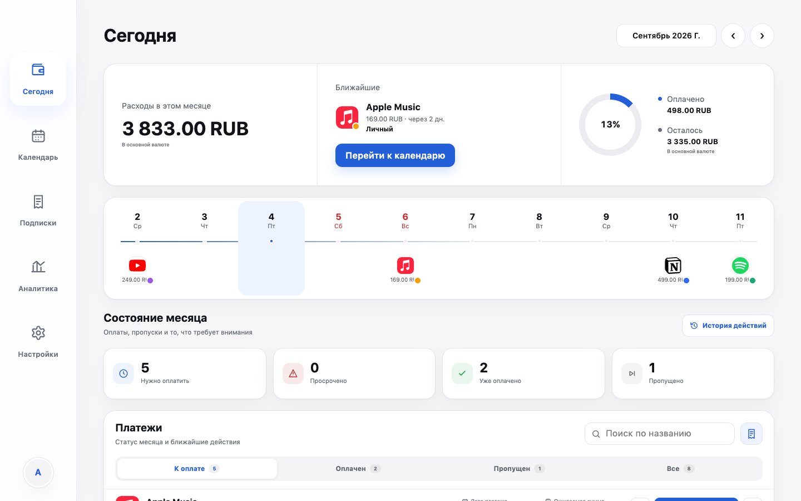</td>
    <td align="center" width="50%">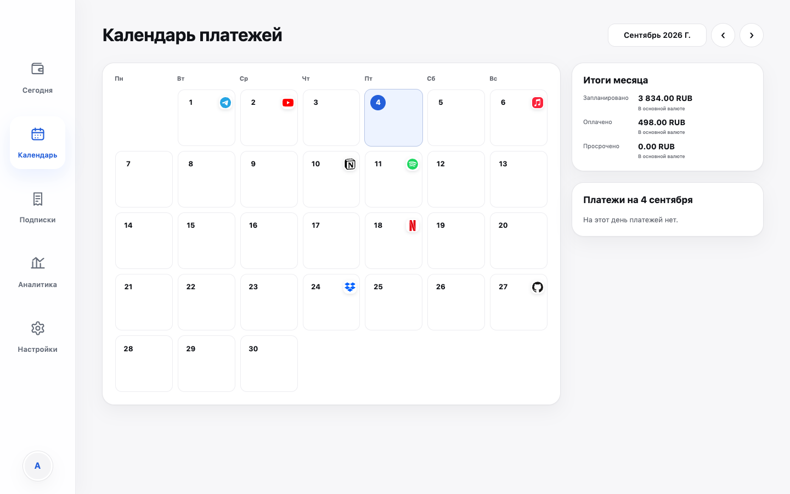</td>
  </tr>
  <tr><td align="center">Сегодня и платежи месяца</td><td align="center">Календарь платежей</td></tr>
  <tr>
    <td align="center">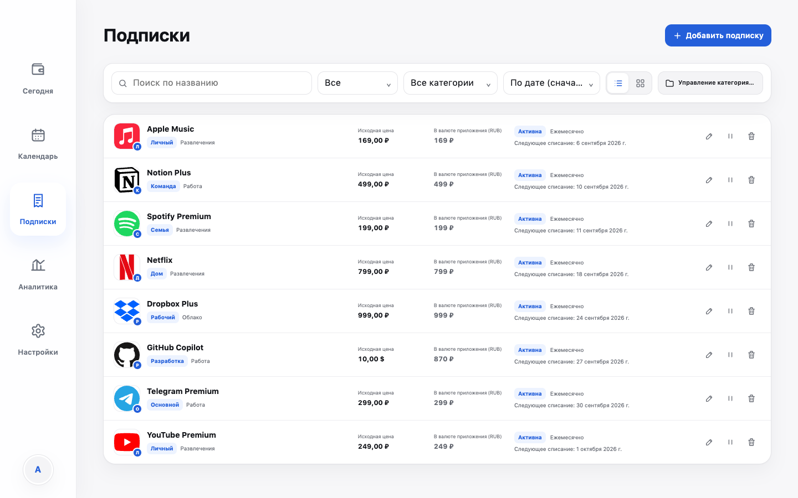</td>
    <td align="center">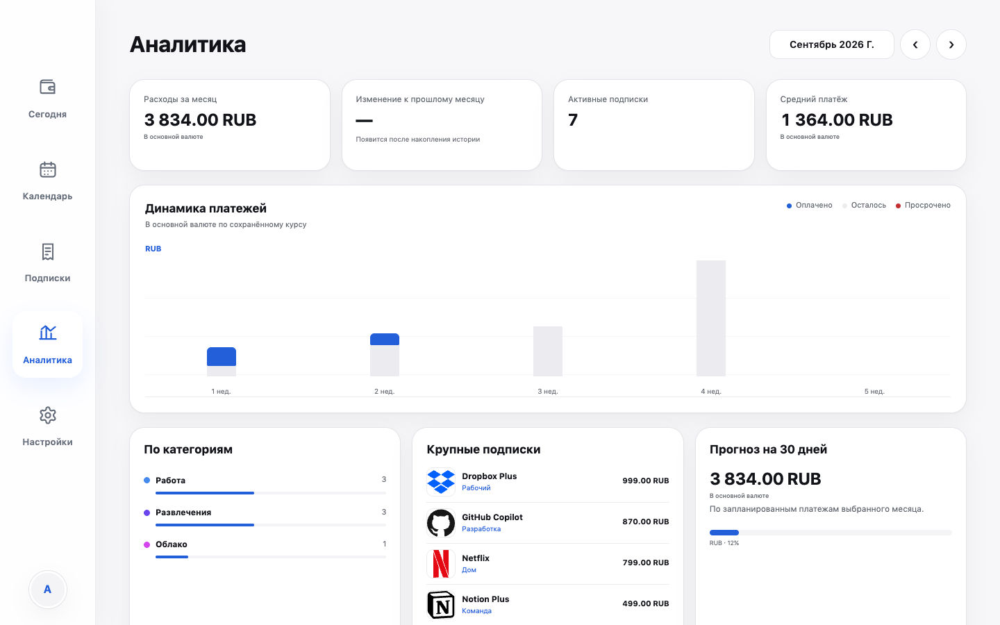</td>
  </tr>
  <tr><td align="center">Подписки, аккаунты и категории</td><td align="center">Аналитика расходов</td></tr>
</table>

### Android — светлая тема

<table align="center">
  <tr>
    <td align="center">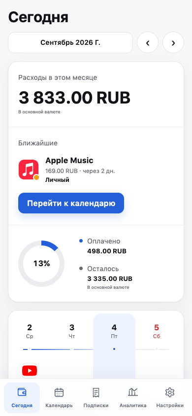</td>
    <td align="center">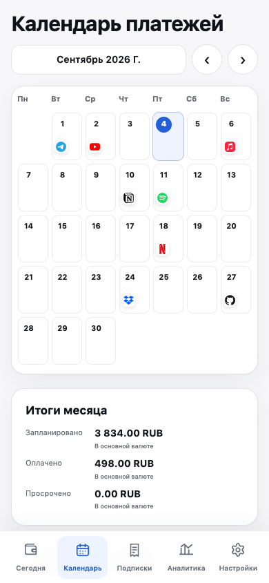</td>
    <td align="center">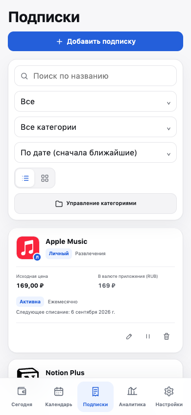</td>
  </tr>
  <tr><td align="center">Сегодня</td><td align="center">Календарь</td><td align="center">Подписки</td></tr>
  <tr>
    <td align="center">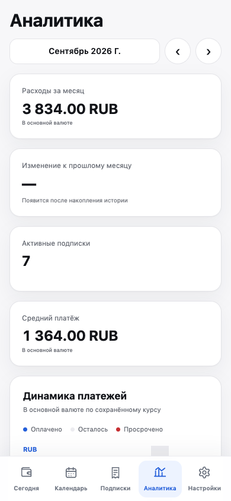</td>
    <td align="center">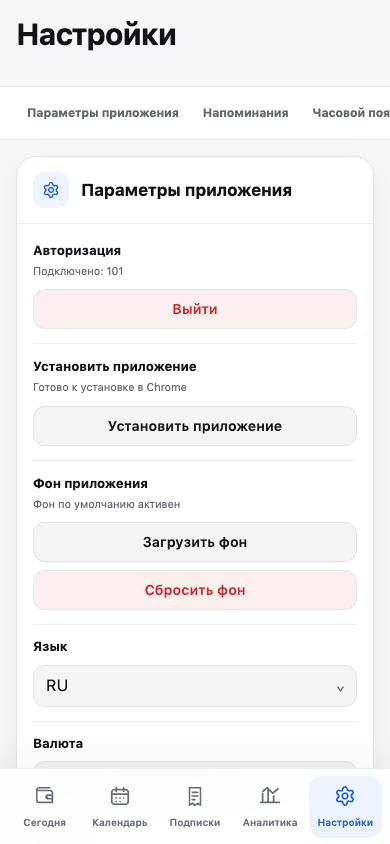</td>
    <td></td>
  </tr>
  <tr><td align="center">Аналитика</td><td align="center">Настройки</td><td></td></tr>
</table>

### Android — тёмная тема

<table align="center">
  <tr>
    <td align="center">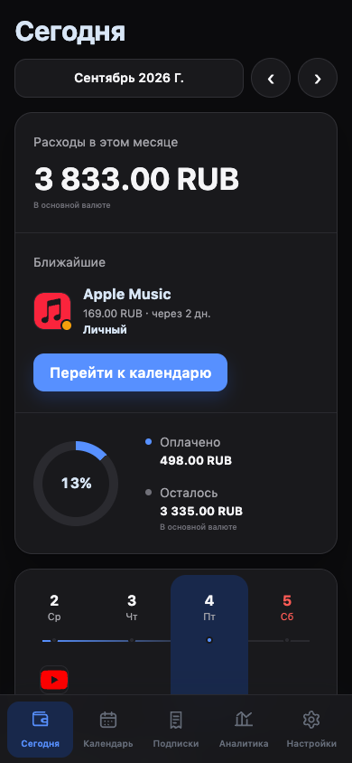</td>
    <td align="center">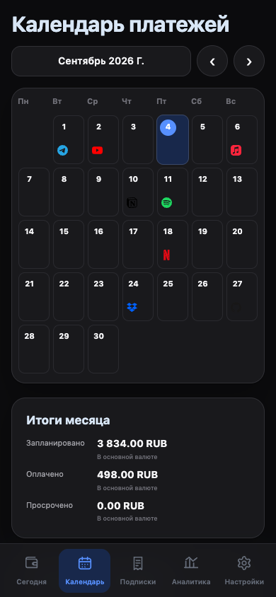</td>
    <td align="center">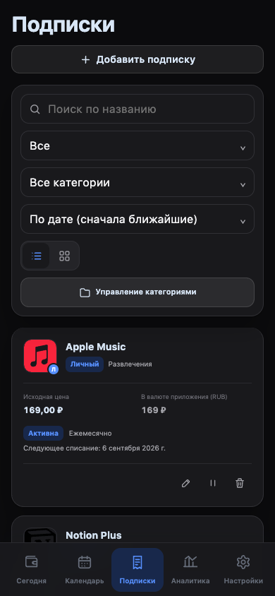</td>
  </tr>
  <tr><td align="center">Сегодня</td><td align="center">Календарь</td><td align="center">Подписки</td></tr>
</table>

## Установка

1. Откройте [последний релиз](https://github.com/svllvsxprod/substrack-releases/releases/latest).
2. Скачайте `SubsTrack-0.1.6-sideload.apk`.
3. Откройте APK на Android-устройстве и подтвердите установку из выбранного источника.
4. При первом запуске разрешите уведомления, если хотите получать напоминания.

Требуется Android 7.0 или новее. Версия 0.1.6 устанавливается поверх 0.1.4 и 0.1.5 без удаления приложения. Веб-версия доступна на [substrack.top](https://substrack.top).

Контрольная сумма APK опубликована рядом с файлом релиза и в `SubsTrack-0.1.6-sideload.apk.sha256`.

## Данные и приватность

- Авторизация выполняется через Google, GitHub или Telegram; SubsTrack не получает пароль от этих сервисов.
- Данные аккаунта синхронизируются с сервером SubsTrack по защищённому соединению.
- Напоминания можно настроить или отключить в любой момент.
- [Политика конфиденциальности](https://substrack.top/privacy) и [условия использования](https://substrack.top/terms) опубликованы на сайте.

## О репозитории

Этот публичный репозиторий предназначен только для готовых сборок, описаний релизов и скриншотов. Исходный код SubsTrack здесь не публикуется.

Нашли ошибку или хотите предложить функцию? Создайте [Issue](https://github.com/svllvsxprod/substrack-releases/issues) или напишите в [Telegram](https://t.me/svllvsxprod).
